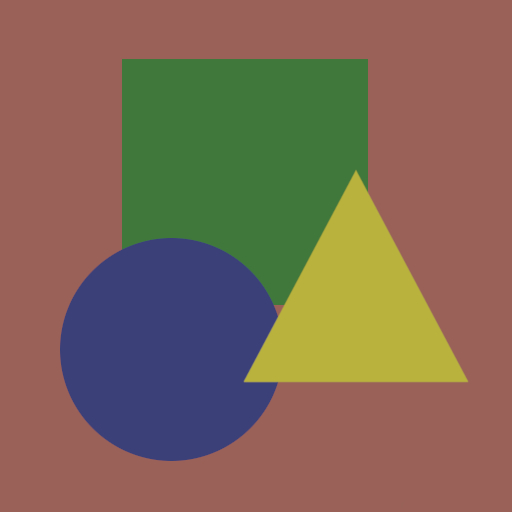

<br/>
<h1>
<p align="center">
    
    <br>Mather
<div align="center">

[](https://github.com/carbone13/mather/actions)
[](https://opensource.org/licenses/MIT)

</div>

</h1>
  <p align="center">
    A library to draw 2D primitives shapes quickly and efficiently.
    <br/>
    </p>
</p>
<p align="center">
  <a href="#about-the-project">About The Project</a> •
  <a href="#how-to-use">How To Use</a> •
  <a href="#examples">Examples</a> • 
  <a href="#dependencies">Dependencies</a> 
</p>  

## About The Project

Mather is a library that allow you to quickly create a windows and to draw simple 2D Shapes.

Currently supporting :

- Line
- Poly Line
- Circle
- Rect
- Polygon

## How to Use

### Importing

Add the library as a dependencies, the most elegant way is to clone it as a git submodule :

```sh
git submodule add https://github.com/Carbone13/mather.git
git submodule update --init --recursive
```

Then add it to your CMakeLists.txt and link to your executable :

```cmake
add_subdirectory(path/to/mather)
...
target_link_libraries(your_project mather)
```

### Usage

The code below demonstrate how to spawn the window and start a rendering loop

```cpp
#include "mather.hpp"

int main()
{
    mather::Context ctx = mather::Context();
    while (!ctx.closeRequested())
    {
        ctx.beginFrame();
        // Here come your rendering code !
        ctx.endFrame();
    }

    return 0;
}
```

You don't need to use this loop at all, you can instead use your own one, just note that you need to surround any draw
calls with `beginFrame()` and `endFrame()`

The `closeRequested()` is set to `true` when the user click on the close button of the window.

TODO : Support custom surface plugging

## Examples

See [main.cpp](demo/main.cpp) in [demo](demo/)

## Dependencies

This project depend on 2 libraries :

- [GLFW](https://github.com/glfw/glfw) for windowing and creating the surface
- [AGG](https://github.com/Carbone13/agg) for sub-pixel anti-aliasing
